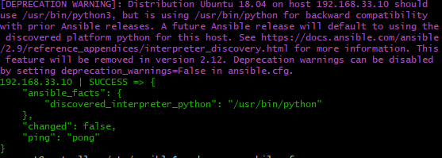

# IaC (infrastructure as code)

## What is it
- is the managing and provisioning of infrastructure through code instead of through manual processes. Helps us codify everything 
## Why do we use it 
- IaC can help your organization manage IT infrastructure needs while also improving consistency and reducing errors and manual configuration
## Where do we use it 
- With IaC, configuration files are created that contain your infrastructure specifications, which makes it easier to edit and distribute configurations
## when do we use it 
- It helps you to align development and operations because both teams can use the same description of the application deployment, supporting a DevOps approach. The same deployment process should be used for every environment, including your production environment.
## how do we use it 
- 
## Confiduration management 
- In the technology world, configuration management is an IT management process that tracks individual configuration items of an IT system.
## Orchetration 
- Orchestration. Orchestration means arranging or coordinating multiple systems
## Tools

## who is using it
- 
## Terraform- Ansible
- Terraform is preferable for containerized solutions deployed for provisioning software within a cloud platform. In comparison, Ansible helps users gain reasonable control over enterprise devices and explore methods for deploying underlying components
## on prem - Hybrid - Cloud
## What other tools are avliable 
## push vs pull config 
- In the pull method, the to be configured server pulls its configuration from the controlling server whereas the push method, the controlling server pushes the configuration to the destination system.

# How to get three machines running and ansible on the controller machine 

## Step 1
- open a new vscode window and add a vagranfile 
## Step 2 
- in the vagrant file add this code for all three machines 
```
# ansible-tech201


# -*- mode: ruby -*-
 # vi: set ft=ruby :
 
 # All Vagrant configuration is done below. The "2" in Vagrant.configure
 # configures the configuration version (we support older styles for
 # backwards compatibility). Please don't change it unless you know what
 
 # MULTI SERVER/VMs environment 
 #
 Vagrant.configure("2") do |config|
 # creating are Ansible controller
   config.vm.define "controller" do |controller|
     
    controller.vm.box = "bento/ubuntu-18.04"
    
    controller.vm.hostname = 'controller'
    
    controller.vm.network :private_network, ip: "192.168.33.12"
    
    # config.hostsupdater.aliases = ["development.controller"] 
    
   end 
 # creating first VM called web  
   config.vm.define "web" do |web|
     
     web.vm.box = "bento/ubuntu-18.04"
    # downloading ubuntu 18.04 image
 
     web.vm.hostname = 'web'
     # assigning host name to the VM
     
     web.vm.network :private_network, ip: "192.168.33.10"
     #   assigning private IP
     
     #config.hostsupdater.aliases = ["development.web"]
     # creating a link called development.web so we can access web page with this link instread of an IP   
         
   end
   
 # creating second VM called db
   config.vm.define "db" do |db|
     
     db.vm.box = "bento/ubuntu-18.04"
     
     db.vm.hostname = 'db'
     
     db.vm.network :private_network, ip: "192.168.33.11"
     
     #config.hostsupdater.aliases = ["development.db"]     
   end
 
 
 end
```

## Step 3
- Vagrant up to get all three machines running
## Step 4
- when SSH into all three machines and run `sudo apt update and upgarde in them` 
## step 5
- intsall ansible with these lines of code 
```
sudo apt-get install software-properties-common
```
```
sudo apt-add-repository ppa:ansible/ansible
```
```
sudo apt-get install ansible -y
```
- This will install ansible

## Step 5
- make sure you can ssh into web from controller vm with `ssh vagnrant@(web IP)`
- then exit back to contorller and run `cd /etc/ansible`
- after this run the code `sudo ansible -m ping web`
##  step 6 if you get failed result 
- go into web with the command above and run 
```
sudo nano authorized_keys #
sudo nano sshd_config # uncomment this line - PermitRootLogin prohibit-password and this - PasswordAuthentication yes

sudo systemctl restart ssh
 
```
then go back into contorller and run `sudo nano ansible.cfg` and run this command line in the file `host_key_checking = false`

if it is all good run the command `sudo ansible -m ping web` you houdl get this result 

# Getting nginx working 
## step one 
- Type in `sudo nano (name of your playbook).yml`
in this file write this code
```
# Create a playbook to configure nginx web server in web machine

# Let's add --- 3 dashes to start  YAML file
---

# Where do we want this playbook to run (ansible controller)
# Add the name of the host
- hosts: web

# Find the facts
  gather_facts: yes
# We need admin access
  become: true

# Add instructions to perform the task
# Intsall nginx in web machine
  tasks:
  - name: Install Nginx in web-server
    apt: pkg=nginx state=present
# ensure nginx is running - status is running 
```
- this will get nginx running 
- To make sure it is running use this command `sudo ansible web -a "systemctl status nginx"`
- You should see this if it is working 

# Getting app to work with playbook 
## step 1
- make a new playbook with same naming convention as before
- in this playbook write this code 
```
# This is to install node for the app to
---
# Where is this playbook going to run

# Adding the name of the host
- hosts: web

# Find the facts
  gather_facts: yes
# We need admin access
  become: true
# Add instructions to perform the task
# Install nginx in web machine

# Ensure that Node is running - status is running

  tasks:
  - name: Clone a github repository
    git:
      repo: https://github.com/AlexColmer/tech201_vertualisation.git
      dest:      C:\Users\alexa\Desktop\Sparta_Global\Traing_courses\tech201_vertualisation\tech201_vertualisation\app\app
      clone: yes
      update: yes

  tasks:
  - name: install node
    apt: pkg=nodejs state=present update_cache=yes
  - name: install npm
    apt: pkg=npm state=present update_cache=yes

  tasks:
  - name: Starting the app
    shell: |
      cd /home/vagrant/app/app/app
      npm install
      pm2 kill
      npm start
      nohup npm start 2>/dev/null 1>/dev/null&

```
after running the code `sudo ansible-playbook (name of playbook).yml` you should get this out put 


# setting up the app to work with the db
## step 1
- install mongodb with a playbook 
```
# create a playbook to configure/install mongodb in db machine
# name of the host/node
---
- hosts: db
# let's get some facts
  gather_facts: yes
#admin access
  become: true
# add instructions - tasks#
  tasks:
  - name: Install mongodb latest version
    apt: pkg=mongodb state=present

```
- then you will need to use a play book to set up the ip in mongodb to be access anywhere 
```
---

- hosts: db

  gather_facts: yes

  become: true

  tasks:
  - name: install mongodb
    apt: pkg=mongodb state=present

  - name: Remove mongodb file (delete file)
    file:
      path: /etc/mongodb.conf
      state: absent

  - name: Touch a file, using symbolic modes to set the permissions (equivalent to 0644)
    file:
      path: /etc/mongodb.conf
      state: touch
      mode: u=rw,g=r,o=r


  - name: Insert multiple lines and Backup
    blockinfile:
      path: /etc/mongodb.conf
      block: |
        # mongodb.conf
        storage:
          dbPath: /var/lib/mongodb
          journal:
            enabled: true
        systemLog:
          destination: file
          logAppend: true
          path: /var/log/mongodb/mongod.log
        net:
          port: 27017
          bindIp: 0.0.0.0

  - name: Restart mongodb
    become: true
    shell: systemctl restart mongodb

  - name: enable mongodb
    become: true
    shell: systemctl enable mongodb

  - name: start mongodb
    become: true
    shell: systemctl start mongodb

```
use this comand to make sure this is running `sudo ansible-playbook mongo-playbook.yml`

- if this runs then you will need to add a line to your node playbook to get the app runnig with posts 
```
---
- hosts: web
  gather_facts: yes
  become: true

  tasks:
  - name: Add environmental variable
    shell:  echo 'export DB_HOST="mongodb://192.168.33.11:27017/posts"' >> ~/.bashrc && source .bashrc
    args:
      executable: /bin/bash
  - name: Install Node
    apt: pkg=nodejs state=present update_cache=yes
  - name: Start the app
    shell: |
      cd /home/vagrant/app/app/app
      npm install
      node seeds/seed.js
      npm start
    environment:
      DB_HOST: mongodb://192.168.33.11:27017/posts
```

if this is written correctly then you should see posts runnig in your browser

# Getting an ec2 instance done automaticlaly 
- creat a new playbook called ec2.yml and in this playbok add this code
```
---

- hosts: localhost
  connection: local
  gather_facts: False

  vars:
    key_name: {key name}
    region: eu-west-1
    image: ami-0ab46afa7fe9b2e96
    id: "alex_tech201_playbook_app"
    sec_group: "sg-0d07d38ae9fe6fb0e"
    ansible_python_interpreter: /usr/bin/python3

  tasks:

    - name: Facts
      block:

      - name: Get instances facts
        ec2_instance_facts:
          aws_access_key: "{{aws_access_key}}"
          aws_secret_key: "{{aws_secret_key}}"
          region: "{{ region }}"
        register: result

      - name: Instances ID
        debug:
          msg: "ID: {{ item.instance_id }} - State: {{ item.state.name }} - Public DNS: {{ item.public_dns_name }}"
        loop: "{{ result.instances }}"

      tags: always


    - name: Provisioning EC2 instances
      block:

      - name: Upload public key to AWS
        ec2_key:
          name: "{{ key_name }}"
          key_material: "{{ lookup('file', '~/.ssh/{{ key_name }}.pub') }}"
          region: "{{ region }}"
          aws_access_key: "{{aws_access_key}}"
          aws_secret_key: "{{aws_secret_key}}"


      - name: Provision instance(s)
        ec2:
          aws_access_key: "{{aws_access_key}}"
          aws_secret_key: "{{aws_secret_key}}"
          key_name: "{{ key_name }}"
          id: "{{ id }}"
          group_id: "{{ sec_group }}"
          image: "{{ image }}"
          instance_type: t2.micro
          region: "{{ region }}"
          wait: true
          count: 1
          instance_tags:
            Name: alex_tech201_playbook_app

      tags: ['never', 'create_ec2']
``` 