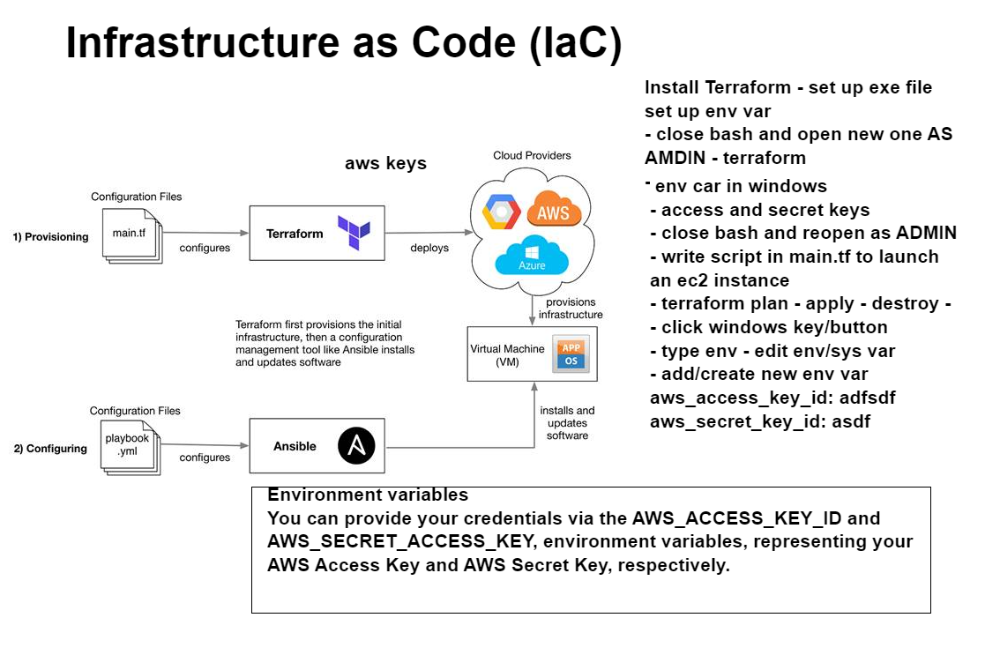

# Terraform

## How to set up terraform

### step 1
- got to https://developer.hashicorp.com/terraform/downloads?product_intent=terraform. and install the version you need. 

### Step 2
- find the file that was downloaded and extarct it.
- cut and creat a new local file and paste it in there.
### step 3 
- press windows key and type in env and environment variable should come up.
- then you need to fin path and click `edit` and then `new`
- add the file path where you pasted terraform 
- if this is done right open up a new git bash terminla iwth admin and type `terraform --version` and you should see the version of tyerraform you just downloaded.
### Step 4
- go back to env variable and where it says user add a new file and add your ssh key pairs.  `AWS_ACCESS_KEY_ID and AWS_SECRET_ACCESS_KEY`

### Step 5
- in vs code make sure that you make a `main .tf` file. 
in that file run this code 
```
provider "aws" {
    region = "eu-west-1"
}
```

### step 7 
- to lainch an ec2 write this in the main.tf file
```
resource "aws_instance" "app_instance" {
  ami = "ami-0cc867a368804a0cc"
  instance_type = "t2.micro"
  associate_public_ip_address = true    
  tags = {
       name = "alex-tech201-terraform-app"
  }
}
```  
### Step 8
- to make sure all the synatx is correct run this code `terraform plan` 

then run `terraform apply`

# How to get a ec2 instacne runnig with your own vpc subnet and security groups 
```
# launch ec2
# which cloud provider - aws
provider "aws" {
    region = "eu-west-1"
}
resource "aws_vpc" "alex_terraform_vpc" {
  cidr_block       = "10.0.0.0/16"
  

  tags = {
    Name = "alex_terraform_vpc"
  }
}
resource "aws_internet_gateway" "gw" {
  vpc_id = var.vpc_id

  tags = {
    Name = "alex-tech201-IG-terraform"
  }
}

resource "aws_subnet" "alex_terraform_vpc" {
  vpc_id     = var.vpc_id
  cidr_block = "10.0.1.0/24"
 

  tags = {
    Name = "alex-tech201-terraform-subnet"
  }
}


resource "aws_route_table" "r" {
  vpc_id = var.vpc_id

  route {
    cidr_block = "0.0.0.0/0"
    gateway_id = var.ig_id
  }

  tags = {
    Name = "alex-tehc201-terraform-ig"
  }
}

resource "aws_route_table_association" "a" {
  subnet_id      = var.subnet_id
  route_table_id = var.rt_id
}

resource "aws_security_group" "alex_tech201_app_sg_ports_22_80_3000" {
  name = "alex-tech201-sg-terraform"
  description = "alex_tech201_app_sg_ports_22_80_3000"
  vpc_id = var.vpc_id
  ingress {
    from_port = "80"
    to_port = "80"
    protocol = "tcp"
    cidr_blocks = ["0.0.0.0/0"]
  }
   ingress { 
    from_port = "22"
    to_port = "22"
    protocol = "tcp"
    cidr_blocks = ["0.0.0.0/0"]
   }
    ingress {
     from_port = "3000"
     to_port = "3000"
     protocol = "tcp"
     cidr_blocks = ["0.0.0.0/0"]
  }  
   egress {
    from_port = 0
    to_port = 0
    protocol = "-1"
    cidr_blocks = ["0.0.0.0/0"] 
  }
  tags = {
    Name = var.public_sg
    }
}

resource "aws_instance" "app_instance" {
  ami = var.webapp_ami_id
  instance_type = "t2.micro"
  associate_public_ip_address = true
  key_name = var.key_id
  subnet_id = var.subnet_id
  vpc_security_group_ids = [var.sg_id]
  tags = {
    Name = var.name_id
 }
}

```